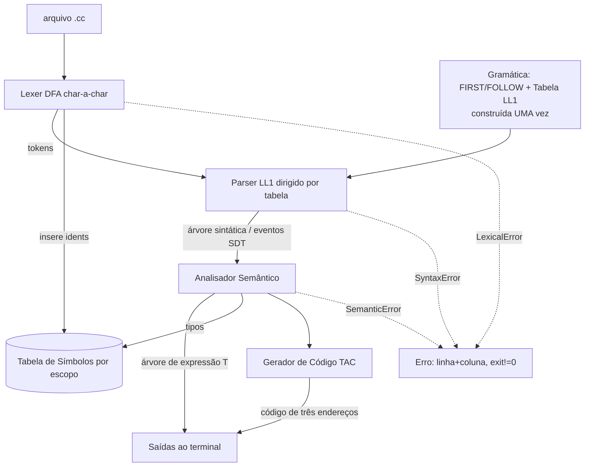

# Design — Compilador ConvCC-2026-1

**Spec**: `.specs/features/compilador/spec.md`
**Status**: Draft

> Conformidade com Decisions (STATE.md): AD-001 (Python 3.11), AD-002 (LL(1) por tabela), AD-003 (DFA manual), AD-004 (TAC), AD-005 (para no 1º erro / PT), AD-006 (pytest provisório). Nenhuma supersessão necessária.

---

## Architecture Overview

Pipeline clássica de compilador em Python 3.11, modular, dirigida por um único driver (`main.py`). Cada fase consome a saída da anterior e **para no primeiro erro** levantando uma exceção tipada com `(linha, coluna)`.



**Princípios:**
- A tabela LL(1) (FIRST/FOLLOW + `parse_table`) é construída **uma vez** na inicialização e reutilizada (atende AS-01).
- O lexer é um DFA escrito à mão, sem gerador (AD-003).
- Erros são exceções com `linha`/`coluna`; o driver captura, imprime e retorna código ≠ 0 (AD-005).

### Abordagens consideradas (Large — exploração)

| Abordagem | Prós | Contras | Decisão |
| --------- | ---- | ------- | ------- |
| **A. Parser por tabela LL(1) + árvore sintática explícita** | Atende o critério "tabela única"; separação limpa fases | Mais infra (FIRST/FOLLOW/tabela) | **Escolhida** (AD-002) |
| B. Descida recursiva | Menos código | Tabela implícita → risco em AS | Rejeitada |
| C. SDT integrada ao parser (sem árvore intermediária) | Menos memória | Acopla semântica ao parsing; mais difícil testar isolado | Parcial: usaremos árvore sintática + travessias L-atribuídas separadas para testar cada ponto |

---

## Code Reuse Analysis

Projeto **greenfield** — não há código a reusar. Apenas biblioteca padrão do Python (`enum`, `dataclasses`, `sys`, `re` apenas como auxílio pontual de classificação — o *scanning* principal é char-a-char manual para cumprir AD-003).

| Componente externo | Uso |
| ------------------ | --- |
| `dataclasses` | `Token`, nós da árvore, entradas da tabela |
| `enum.Enum` | `TokenType`, tipos da linguagem (`int/float/string`) |
| `sys` | leitura de argumentos / `exit code` |
| `pytest` (dev) | suíte de testes (AD-006, provisório) |

### Integration Points
Nenhum sistema externo. Entrada = arquivo de texto `.cc`; saída = stdout.

---

## Components

### `tokens.py` — Modelo de token
- **Purpose**: Definir `TokenType` e a estrutura `Token`.
- **Location**: `src/tokens.py`
- **Interfaces**:
  - `class TokenType(Enum)` — `DEF, INT, FLOAT, STRING, PRINT, READ, RETURN, IF, ELSE, FOR, BREAK, NEW, NULL, IDENT, INT_CONST, FLOAT_CONST, STRING_CONST, LPAREN, RPAREN, LBRACE, RBRACE, LBRACK, RBRACK, SEMI, COMMA, ASSIGN, LT, GT, LE, GE, EQ, NE, PLUS, MINUS, STAR, SLASH, PERCENT, EOF`
  - `@dataclass Token(type: TokenType, lexeme: str, line: int, col: int)`
- **Dependencies**: `enum`, `dataclasses`. **Reuses**: —

### `errors.py` — Erros com posição
- **Purpose**: Hierarquia de erros que carregam `linha`/`coluna` e mensagem em PT.
- **Location**: `src/errors.py`
- **Interfaces**:
  - `class CompilerError(Exception)` — base com `linha`, `coluna`, `mensagem`, `__str__` formatado.
  - `class LexicalError / SyntaxError_ / SemanticError(CompilerError)`
- **Dependencies**: —. **Reuses**: —

### `symbol_table.py` — Tabela de símbolos por escopo
- **Purpose**: Entrada por `ident` com lista de ocorrências `(linha,coluna)`, atributo de tipo e **propriedades extensíveis**; pilha de escopos.
- **Location**: `src/symbol_table.py`
- **Interfaces**:
  - `class Symbol(nome, tipo=None, props: dict, ocorrencias: list[(int,int)])`
  - `class Scope` — `declarar(nome, tipo, linha, col)`, `resolver_local(nome)`, `tem_local(nome)`
  - `class SymbolTable` — `push_scope()/pop_scope()`, `declarar(...)`, `resolver(nome)` (busca da pilha do topo à base), `registrar_ocorrencia(nome, linha, col)`, `set_tipo(nome, tipo)`, `dump()` (impressão por escopo)
- **Dependencies**: `errors`. **Reuses**: —
- **Notas**: AL-02 pede UMA entrada por `ident` com lista de ocorrências; a tabela global do léxico registra ocorrências; a tabela por escopo (semântico) gerencia visibilidade (ASEM-04). Modelar como tabela global de léxico + pilha de escopos semânticos compartilhando `Symbol`.

### `lexer.py` — Analisador léxico (DFA manual)
- **Purpose**: Ler char-a-char e emitir `Token`s; registrar `ident`s na tabela; erro léxico com posição.
- **Location**: `src/lexer.py`
- **Interfaces**:
  - `class Lexer(fonte: str, tabela: SymbolTable)`
  - `proximo_token() -> Token` (DFA: estados para identificador/keyword, números int/float, string, operadores compostos `<= >= == !=`, comentários se confirmados)
  - `tokens() -> Iterator[Token]`
- **Dependencies**: `tokens`, `errors`, `symbol_table`. **Reuses**: —
- **Diagramas de transição**: documentar em `docs/diagramas-lexico.md` (atende exigência AL).

### `grammar.py` — Gramática LL(1), FIRST/FOLLOW e tabela
- **Purpose**: Codificar a gramática **convencional já transformada (LL(1))**; calcular FIRST/FOLLOW; construir a tabela preditiva **uma vez**; detectar conflitos.
- **Location**: `src/grammar.py`
- **Interfaces**:
  - `PRODUCOES: dict[str, list[list[str]]]` (não-terminais → alternativas; `ε` explícito)
  - `first(simbolo) -> set`, `follow(nt) -> set`
  - `build_parse_table() -> dict[(nt, terminal), producao]` — levanta erro em conflito não resolvido (exceto resoluções documentadas: dangling-else)
- **Dependencies**: `tokens`. **Reuses**: —

### `parser.py` — Parser preditivo por tabela
- **Purpose**: Parser não-recursivo com pilha; aceita/rejeita; constrói árvore sintática; erro sintático com posição.
- **Location**: `src/parser.py`
- **Interfaces**:
  - `class Parser(tokens: list[Token], tabela_ll1)`
  - `parse() -> ParseNode` (raiz `PROGRAM`); levanta `SyntaxError_` no primeiro erro com `(linha, coluna)`, esperado/encontrado
- **Dependencies**: `grammar`, `tokens`, `errors`, `ast_nodes`. **Reuses**: —

### `ast_nodes.py` — Nós de árvore (sintática e de expressão)
- **Purpose**: `ParseNode` (árvore de derivação) e `ExprNode` (árvore de expressão T: só operadores/operandos).
- **Location**: `src/ast_nodes.py`
- **Interfaces**:
  - `@dataclass ParseNode(simbolo, filhos, token=None)`
  - `@dataclass ExprNode(valor, esq=None, dir=None, tipo=None)`; `pre_ordem() -> list` (raiz-esq-dir, atende ASEM-01/OUT-01a)
- **Dependencies**: —. **Reuses**: —

### `semantic.py` — Analisador semântico (5 pontos)
- **Purpose**: Travessias L-atribuídas sobre a árvore: (1) construir `ExprNode` para EXPA; (2) inserir tipos (DEC); (3) verificar tipos; (4) escopos; (5) `break` em `for`.
- **Location**: `src/semantic.py`
- **Interfaces**:
  - `class SemanticAnalyzer(arvore: ParseNode, tabela: SymbolTable)`
  - `construir_arvores_expressao() -> list[ExprNode]` (ASEM-01)
  - `inserir_tipos()` (ASEM-02)
  - `verificar_tipos()` (ASEM-03) — tipo de nó = tipo único dos operandos; mistura → `SemanticError`
  - `verificar_escopos()` (ASEM-04) — push/pop em `FUNCDEF`, `{STATELIST}`, `for`, `if`; redeclaração/colisão → erro
  - `verificar_break()` (ASEM-05) — contador de aninhamento de `for`
- **Dependencies**: `ast_nodes`, `symbol_table`, `errors`. **Reuses**: —

### `codegen.py` — Gerador de código intermediário (TAC)
- **Purpose**: SDT que emite código de três endereços para a árvore.
- **Location**: `src/codegen.py`
- **Interfaces**:
  - `class CodeGen()` — `novo_temp()`, `novo_rotulo()`, `emit(instr)`, `gerar(arvore) -> list[str]`
  - Regras por construção: EXPRESSION/NUMEXPRESSION/TERM (temporários, precedência), ATRIBSTAT, IF/ELSE (rótulos+goto), FOR, PRINT, READ, ALLOC/arrays, FUNCDEF/RETURN/FUNCCALL.
- **Dependencies**: `ast_nodes`. **Reuses**: —

### `main.py` — Driver / CLI
- **Purpose**: Orquestrar a pipeline e imprimir as 6 saídas ou o erro.
- **Location**: `main.py`
- **Interfaces**: `python3.11 main.py <programa.cc>` → stdout; `exit 0` sucesso, `≠0` erro.
- **Dependencies**: todos os módulos. **Reuses**: —

---

## Data Models

### Token
```python
class TokenType(Enum): ...  # ver tokens.py
@dataclass
class Token:
    type: TokenType
    lexeme: str
    line: int
    col: int
```

### Symbol
```python
@dataclass
class Symbol:
    nome: str
    tipo: str | None = None          # 'int' | 'float' | 'string'
    dimensoes: list[int] = field(default_factory=list)  # arrays
    props: dict = field(default_factory=dict)            # extensível (AL-02)
    ocorrencias: list[tuple[int,int]] = field(default_factory=list)  # (linha,col)
```

### ExprNode (árvore de expressão T)
```python
@dataclass
class ExprNode:
    valor: str          # operador ('+','*',...) ou operando (ident/const)
    esq: 'ExprNode|None' = None
    dir: 'ExprNode|None' = None
    tipo: str|None = None
```

---

## Error Handling Strategy

| Cenário | Tratamento | Impacto ao usuário |
| ------- | ---------- | ------------------ |
| Caractere/lexema inválido | `LexicalError(linha,col)` | Mensagem PT + posição; exit≠0 |
| Token inesperado / entrada não pertence | `SyntaxError_(linha,col, esperado, encontrado)` | Mensagem + posição; exit≠0 |
| Tipos mistos em expressão | `SemanticError(linha,col)` | Mensagem + posição |
| Redeclaração / colisão de nome no escopo | `SemanticError` | Mensagem + posição |
| `break` fora de `for` | `SemanticError` | Mensagem + posição |
| Qualquer erro | **para no primeiro** (AD-005) | Uma mensagem, sem cascata |

---

## Risks & Concerns

| Concern | Local | Impacto | Mitigação |
| ------- | ----- | ------- | --------- |
| Conflito LL(1) em `ATRIBSTAT` (`ident(` FUNCCALL vs `ident[` LVALUE/EXPRESSION) | `grammar.py` | Tabela com conflito → AS perde pontos | Fatorar prefixo `ident`; testar entradas da tabela; documentar em `docs/gramatica.md` |
| Dangling-else | `grammar.py` | Ambiguidade na tabela | Resolver casando `else` mais próximo; documentar (AD-005 assumptions) |
| Tabela de símbolos: AL pede "uma entrada por ident + ocorrências" vs semântica pede "uma por escopo" | `symbol_table.py` | Modelo confuso/dupla fonte de verdade | Tabela global de ocorrências (léxico) + pilha de escopos (semântico) compartilhando `Symbol`; documentar o contrato |
| EXPA/DEC: separar produções para SDD pode divergir do parser | `semantic.py`, `docs/` | Inconsistência teoria↔código | Derivar `semantic.py` das mesmas produções de `grammar.py`; teste cruzado |
| Comentários na linguagem-fonte indefinidos na BNF | `lexer.py` | Programas-exemplo podem usar `//` e falhar | Não suportar até confirmação; programas-exemplo sem comentários de código (usar só onde a linguagem permitir) — confirmar com monitor |
| Warnings (Python: avisos do interpretador, lint) reduzem nota | todo o código | Perda direta de nota | `python -W error` em CI local; código limpo; sem imports não usados |
| Prazo já passado (27-jun > 26-jun) | — | Entrega pode não ser aceita | Confirmar prorrogação antes de investir no Execute |

> Concerns reais identificados acima — não é "nenhum".

---

## Tech Decisions (não-óbvias)

| Decisão | Escolha | Racional |
| ------- | ------- | -------- |
| Estrutura de produções | `dict` nt→lista de alternativas, com `'ε'` e `'$'` explícitos | Facilita FIRST/FOLLOW e construção/teste da tabela |
| Árvore de derivação vs SDT integrada | Construir `ParseNode` e fazer travessias L-atribuídas separadas | Permite testar cada um dos 5 pontos semânticos isoladamente |
| Tabela de símbolos dupla (léxico global + escopos) | Compartilhar objeto `Symbol` | Atende AL-02 e ASEM-04 sem duplicar verdade |
| Saída de árvore | Pré-ordem (raiz-esq-dir) conforme `bint.html` do enunciado | Exigência OUT-01a |

> Decisões de nível de projeto já registradas em `STATE.md` (AD-001..AD-006).
